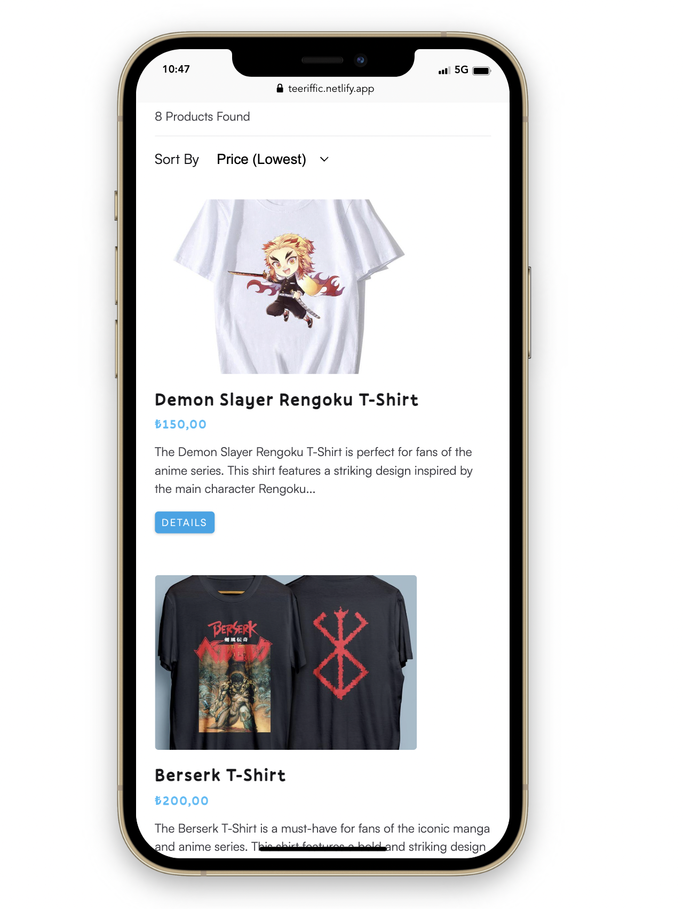
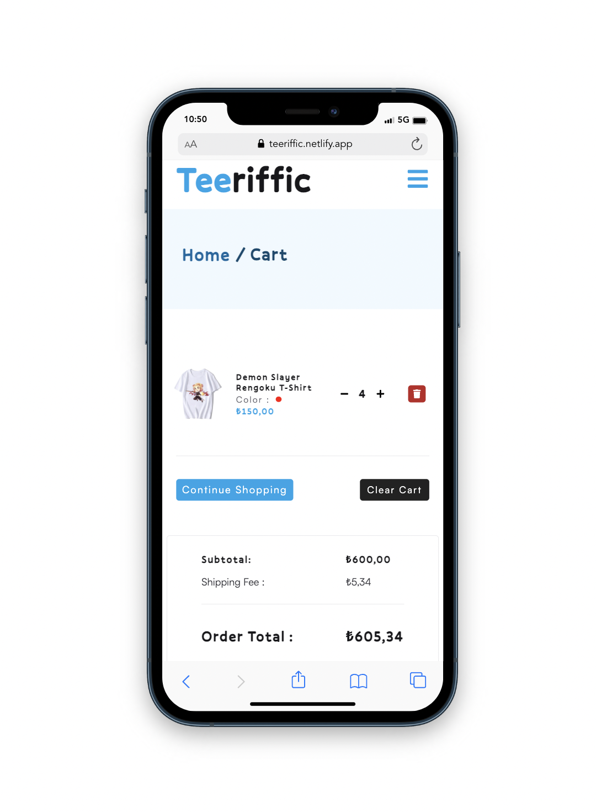
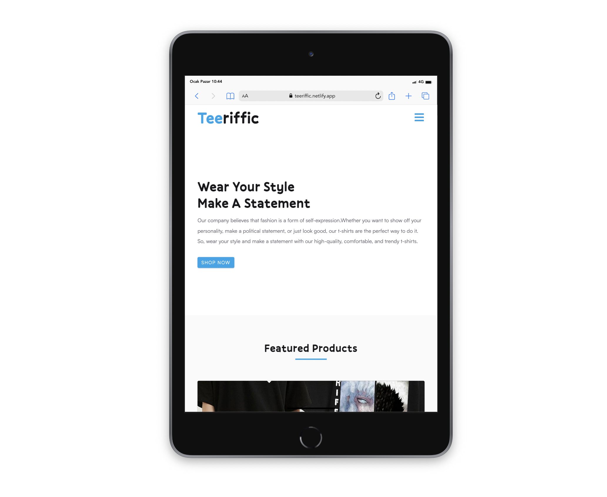
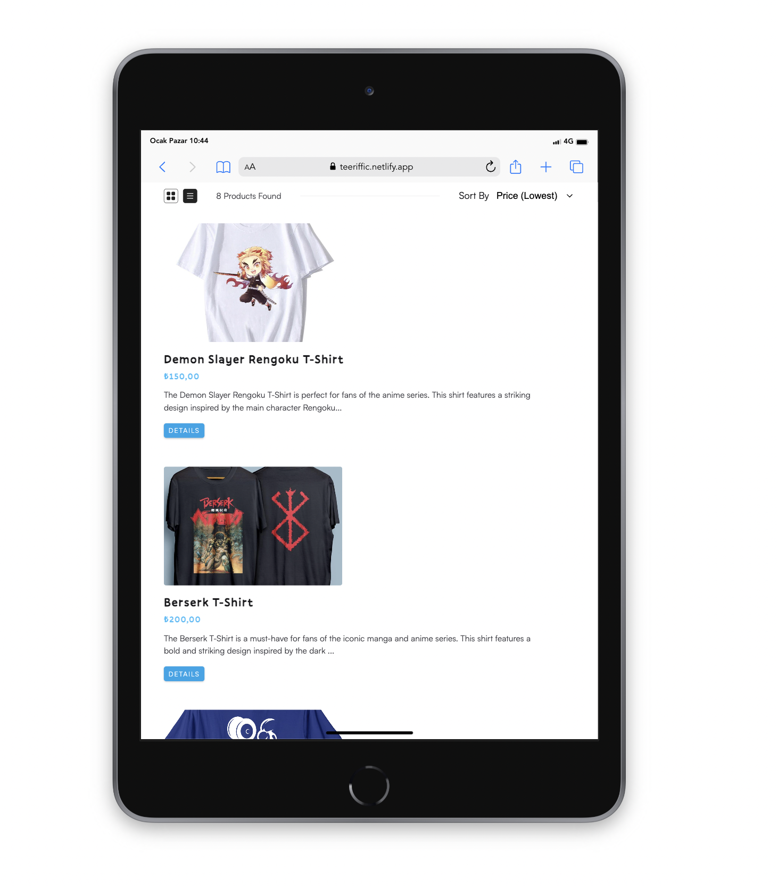
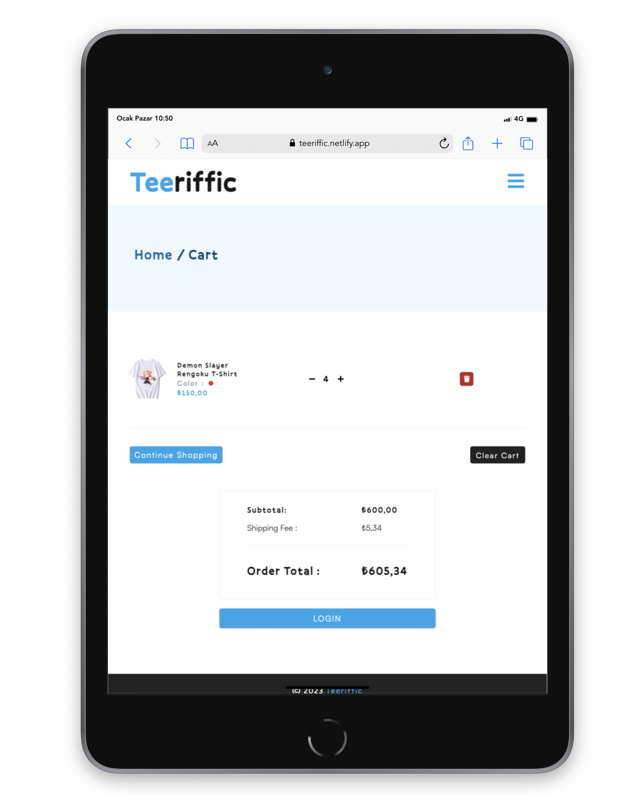
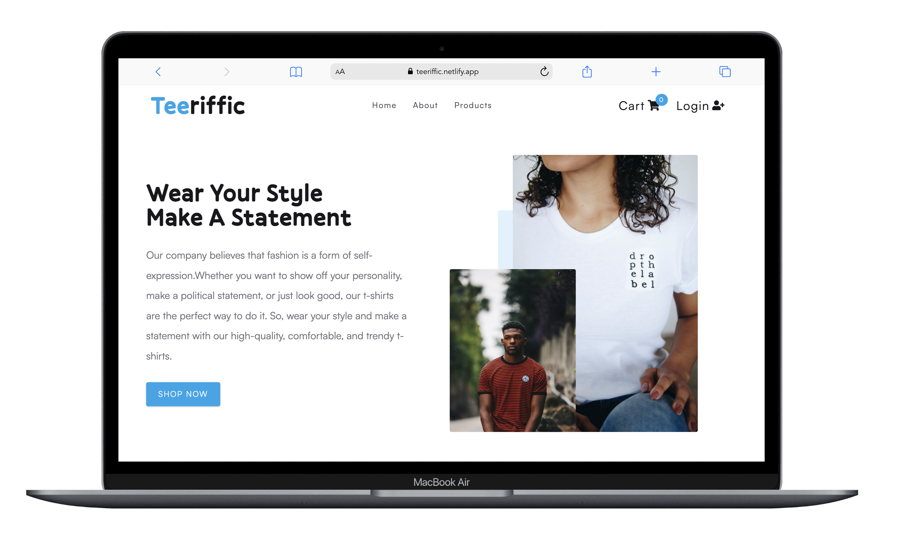
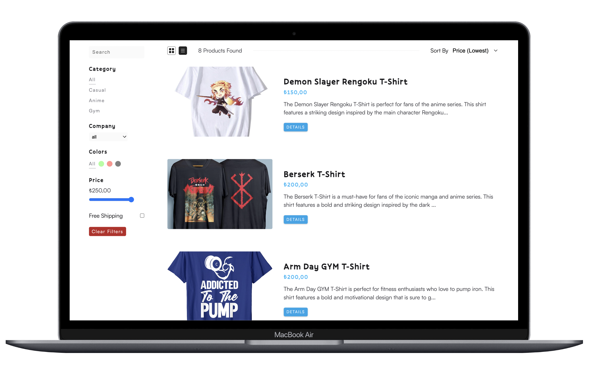
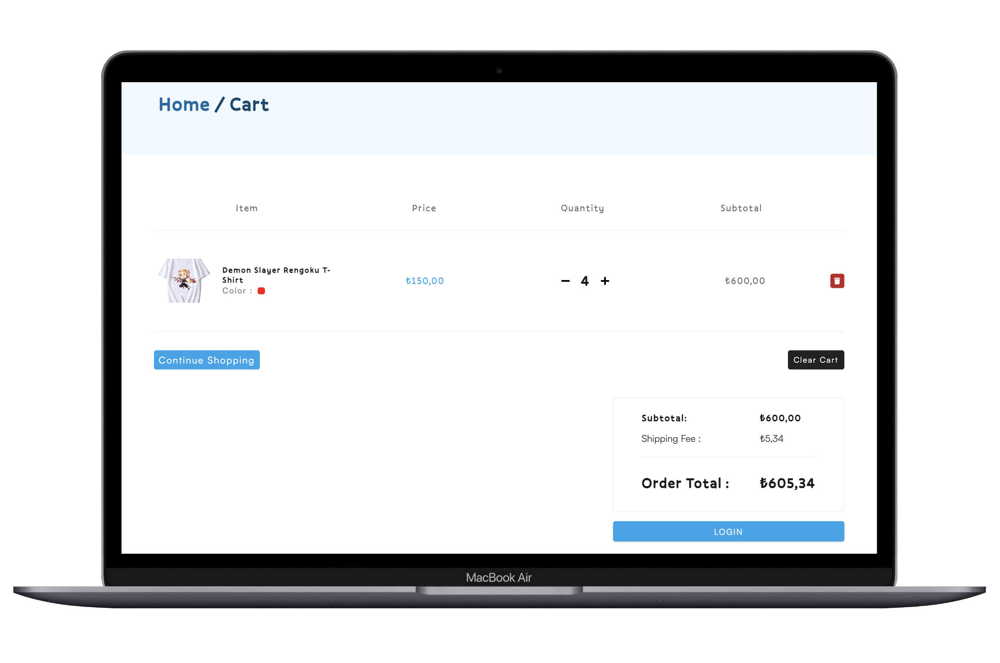

# Teeriffic E-Commerce Store

- This project is built using <strong>React.js</strong> , specifically utilizing hooks and the Context API for a seamless user experience.
- Navigation is made easy with <strong>React-Router</strong>, and styling is done with the powerful library of <strong>styled components.</strong>
- Payment processing is handled securely with <strong>Stripe</strong>, and user authentication is managed with <strong>Auth0</strong>.
- I used <strong>axios</strong> for data fetching and dotenv for managing sensitive information.
- The server side is powered by <strong>Netlify serverless functions</strong> for a reliable and efficient service.

# LIVE Demo
<p>You can checkout the live demo of application on netlify via this <a href="https://teeriffic.netlify.app">link</a></p>

# Showcase

## Mobile View

### Page Hero


### Products Page



### Cart Page



<hr/>

## Tablet View

### Page Hero



### Products Page



### Cart Page



<hr/>

## Desktop View

### Page Hero



### Products Page



### Cart Page



## Technologies Used

- React.js (hooks, Context API)
- React-Router
- Styled Components
- Stripe
- Auth0
- axios
- dotenv
- Netlify serverless functions

## Usage

1. Clone the repo

```sh
git clone https://github.com/BraveHeart-tex/Teeriffic-E-Commerce
```

2. Install the dependencies

```sh
npm install or yarn add
```

3. In the root of the project, create a .env file. Provide the fields below.

```
REACT_APP_AUTH_DOMAIN=YOUR AUTH0 DOMAIN
REACT_APP_AUTH_CLIENT_ID=YOUR AUTH0 CLIENT ID
REACT_APP_STRIPE_PUBLIC_KEY=YOUR STRIPE PUBLIC KEY
REACT_APP_STRIPE_SECRET_KEY=YOUR STRIPE SECRET KEY
AIRTABLE_API_KEY=YOUR AIRTABLE API KEY
AIRTABLE_BASE=YOUR AIRTABLE BASE ID
AIRTABLE_TABLE=YOUR AIRTABLE TABLE NAME
```

4. Run the development server. This will run the `netlify dev` command

```sh
npm run dev
```

5. Build for production

```sh
npm run build
```

# Author

- <h3>Bora Karaca</h3>
